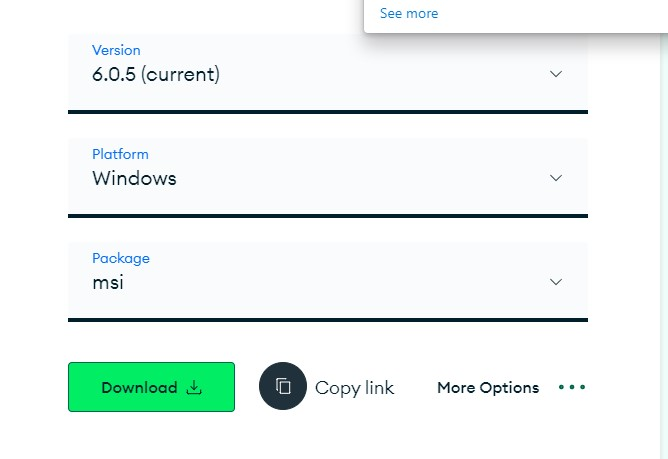
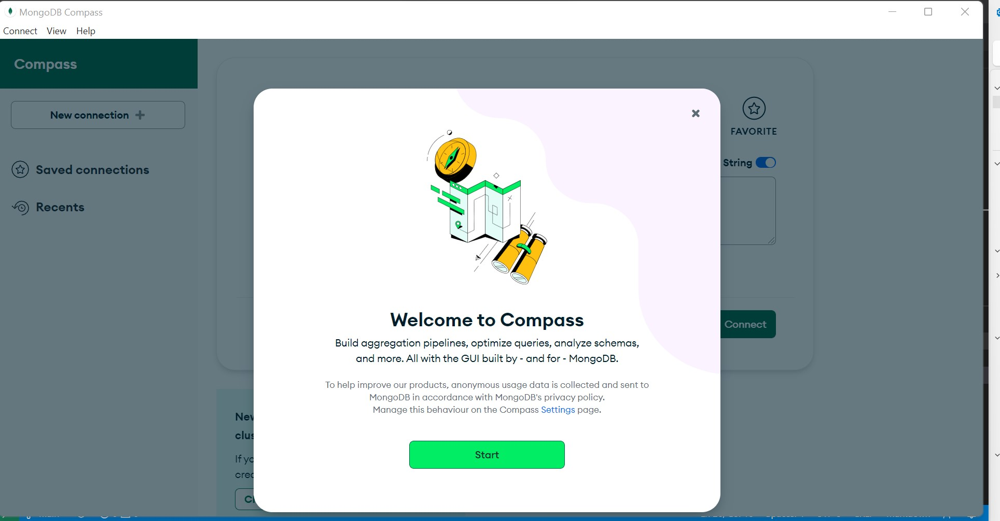
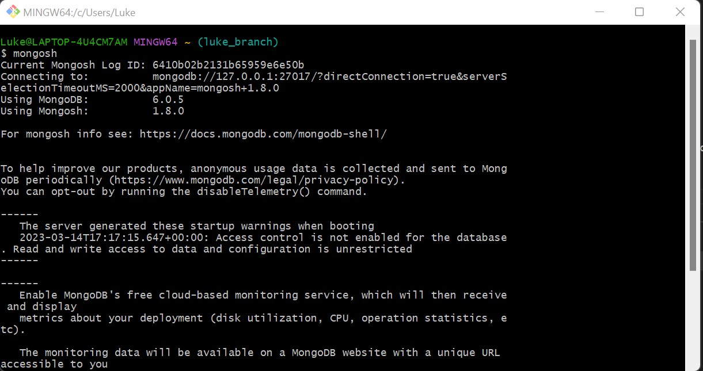

# MongoDB install and setup

MongoDB is a no-sql database that has become a market leader recently. Let's look at how to set it up locally (on a windows machine) so we can start using it.

The official documentation for this can be found here:
https://www.mongodb.com/docs/manual/administration/install-community/

## Download the installer

- Select MongoDB version
- Then select 'Windows' from the 'Platform' dropdown menu
- In the 'Package' dropdown menu select 'msi'
- Download

## Run the MongoDB installer

Simply double-click the downloaded file

## Follow the installation wizard

- Choose 'Complete' setup type. Installs MongoDB and tools to the default location.
- You may as well install MOngoDB Compass while you are here as it is needed to interact with MongoDB easily.
- Click 'Install'

When the install finshes you will be notified. If you installed Compass too, it should open:

# Install the shell (mongosh)

We need a shell so we can access mongoDB properly using a terminal. The msi installer does not include it by default.

The instructions for installing mongosh can be found here:
https://www.mongodb.com/docs/mongodb-shell/install/

The easiest way is to use the available msi:

- In the Platform dropdown, select Windows 64-bit (8.1+) (MSI)
- Click Download.
- Double-click the installer file.
- Follow the prompts to install mongosh.

## Interacting with MongoDB using the terminal

Once mongosh is installed, if you have a running environment you can simply type 'mongosh' into the terminal and it will allow you to interact:

