## MongoDB Guide

### What is NoSQL?

- Umbrella term, to refer to any datbase systems that do not primarily run on SQL.

### MongoDB

General purpose Document database with the scalability and flexibility that you want with the querying and indexing that you need.

Stores **JSON-like documents** that allow you to store data with flexible schema while still being able to query, aggregate and more (for analyise access and analysis).

- MongoDB (Local)
- MongoDB Atlas (Multi-Cloud Platform)
- MongoDB Compass (GUI interface for Mongo)

### Common NoSQL DB types

- Key-Value
- Column-Family
- Graph
- Document (MongoDB)

>LEARN MORE: https://www.mongodb.com/scale/types-of-nosql-databases

### What is a Document database?

Document (basic unit of data in MongoDB):

```bson
{
    "_id": "302439049230vi00weuv0wu01",
    "firstname": "Jane",
    "lastname":  "Wi",
    "address": {
        "street": "1 Circle Rd,
        "city": "Los Angeles",
        "state": "CA",
        "zip": "90404"
    }
    "hobbies": ["surfing", "coding"]
}
```

MongoDB Database (Can contain one or more collections)<br>
      -> Collections (Can contain multiple documents)<br>
          -> Document (Key value pair list or array or nested document)

## Using Atlas

Make a new organisation and make a project inside it. You will then be greeted with this page:

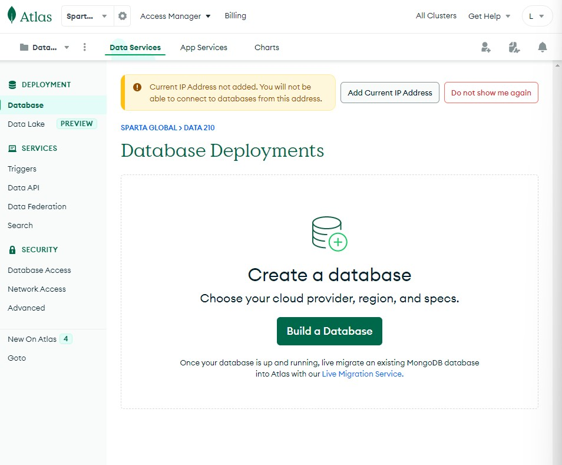

### Making a Cluster

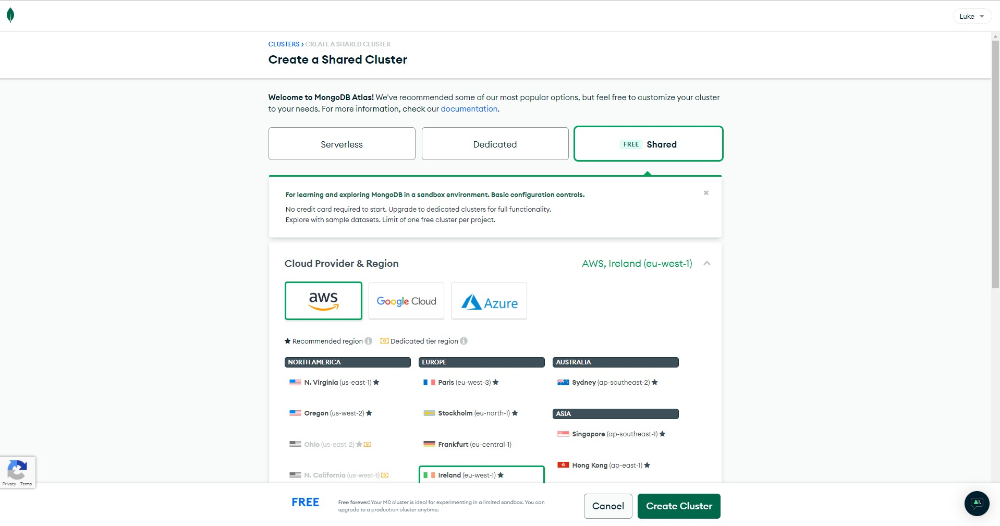

## Security setup

User:
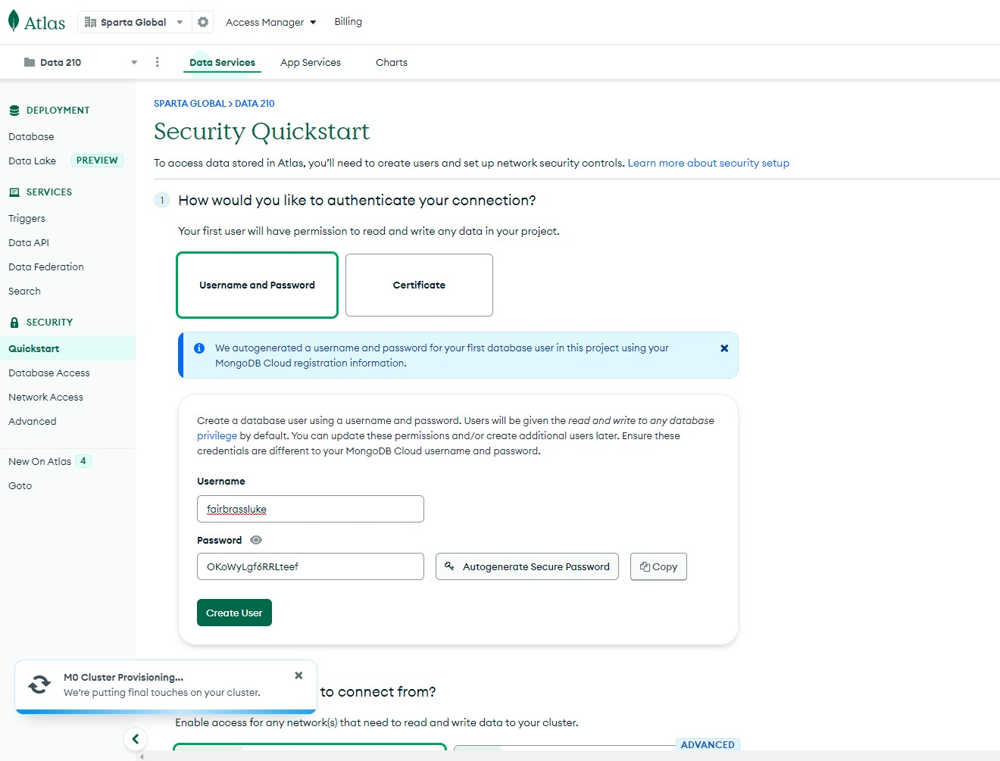

I.P:
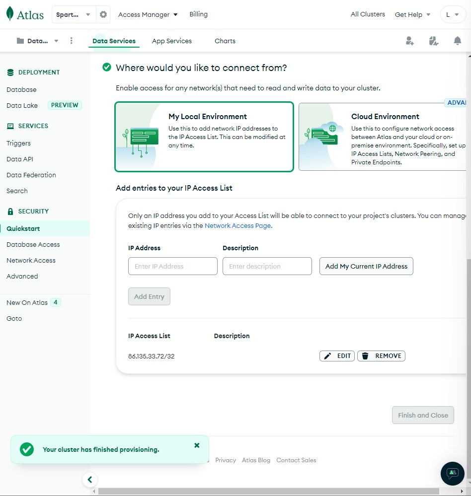


## Cluster Created!

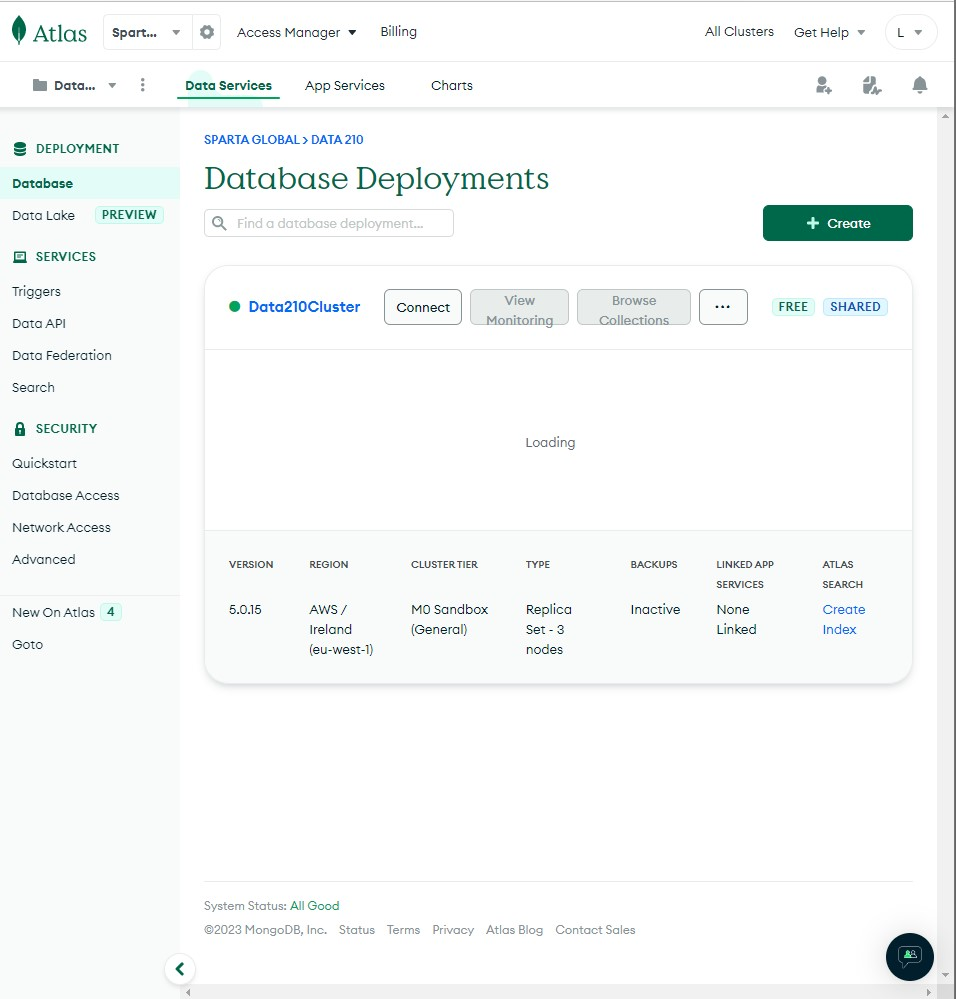


## Load Sample data into the new DB

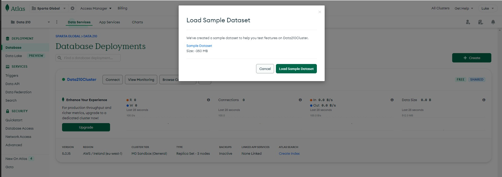

## Connecct to Atlas DB:

Click 'Connect' when viewing your database

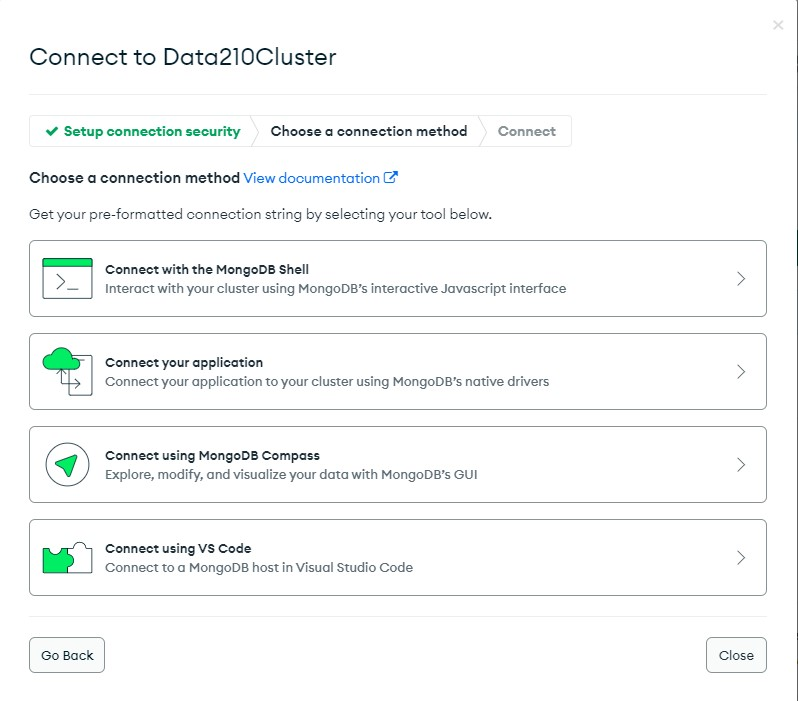

We can easily use any of these. Let's use Compass first:

Take the URI to connect and paste it your compass connection. Make sure to change the password part of the URI to your password (remove the <> too).

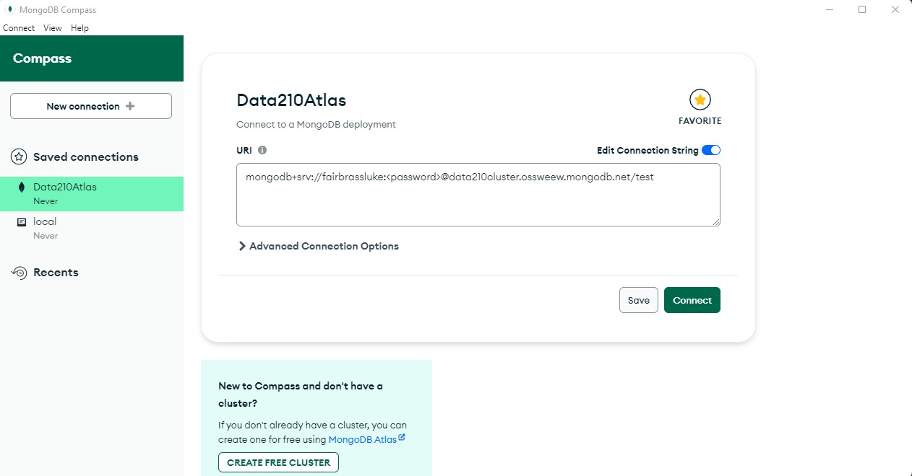

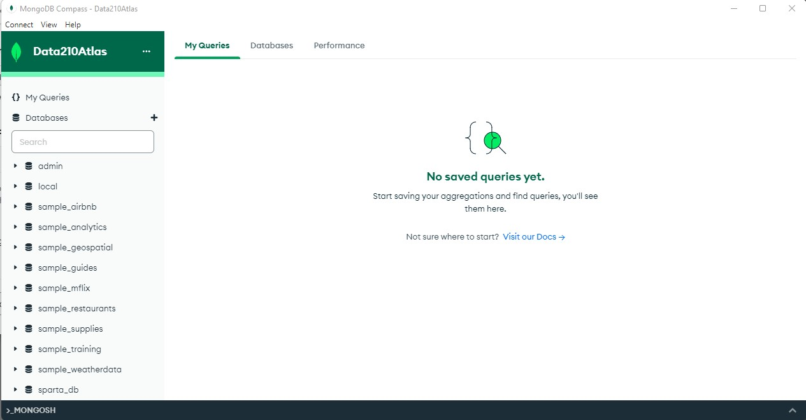

## Mongo CRUD

Create, Remove, Update, Delete

First, get the connection command from Atlas for Mongosh. Paste it in your terminal of choice.

It should ask for your password. Enter it and you should then be connected:

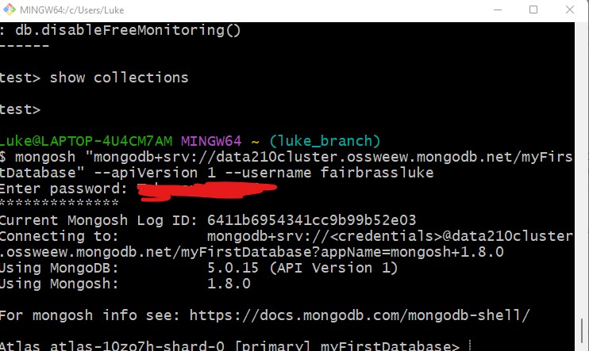

- `show databases` to see all the databses available
- `use database` switches to using a particular db (so `use sparta_db`)
- `show collections`

### Make a new collection

If you do db.collection and the collection does not exist, mongo will create it. Be careful!

## Insert (Create)

Simply use the collection you want to use, and then insertOne. See below for syntax

```
db.trainers.insertOne({firstname: "Luke", Surname: "Fairbrass", department: "DevOps", "Data"})
```

```
db.trainers.insertOne({firstname: "Alan", Surname: "Gulle", department: "Data"})
```

# C - Create

## SELECT * FROM TRAINERS

Simlpy use .find() to see everything in the collection (table)
`db.trainers.find()`

## Insert Many

```db.learners.insert```

Will ask if you want One or Many. For many:

```
db.learners.insertMany([{firstname: "Andre"}, {firstname:"Joy"}])
```
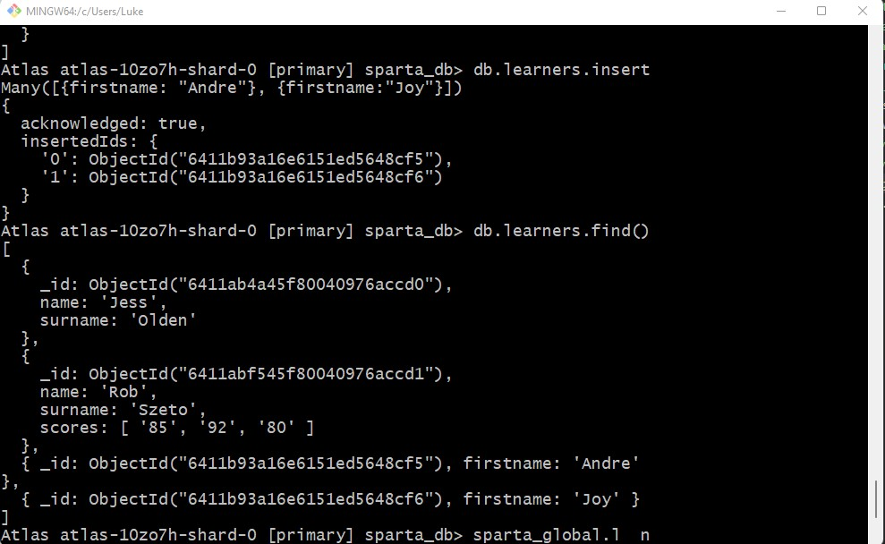

Lets see the changes on Atlas:

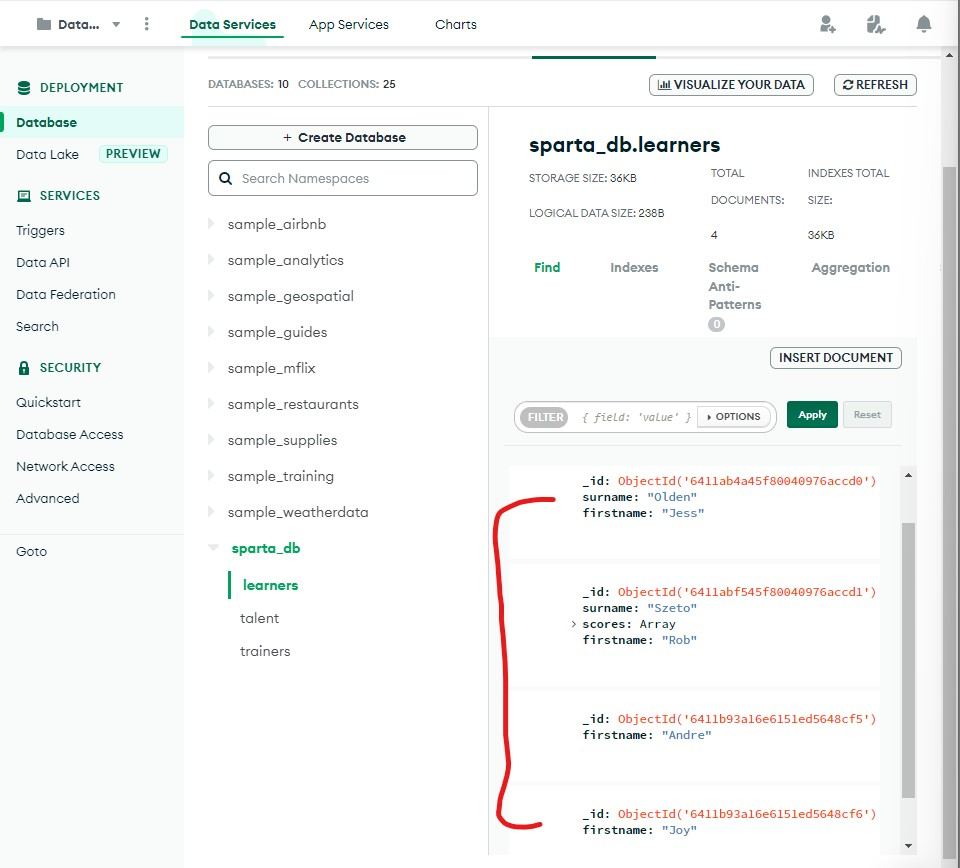

# R - Retrieve/Read

## find() and $in

find everything:

```db.<collection>.find()```

find a specific value:
```db.<collection>.find({field: $eq: <value>})```

so

```db.learners.find({name: "Jess"})```

## Projection

This is similar to WHERE in SQL. Just find certain parts of each doc:

```{name:1, property_type:1, room_type:1, bedrooms:1, beds:1, amenities:1}```

## Comparisons

How do we compare in Mongo? 

Here is an example using $gt

```db.listingsAndReviews.find({bedrooms:{$gt:10}},{bedrooms:1, beds:1, price:1})```

`$gt` = greater than

so `$gt:10` means greater than 10

`$gte` = greater than or equal to


`$lt: 2`
`$lt` = less than

`$lte` = less than or equal to.

## Multiple finds using $and

```db.collection.find($and: [ {expression}, {expression},....])```

OR is exactly the same:


```db.collection.find($or: [ {expression}, {expression},....])```

## $and and comparison operator

```db.collection.find({$and:[{bedrooms:{$lte:3}}, {beds:3}]})```

Gets less than or equal to 3 bedrooms but must have 3 bedrooms

## Example of the above in compass:

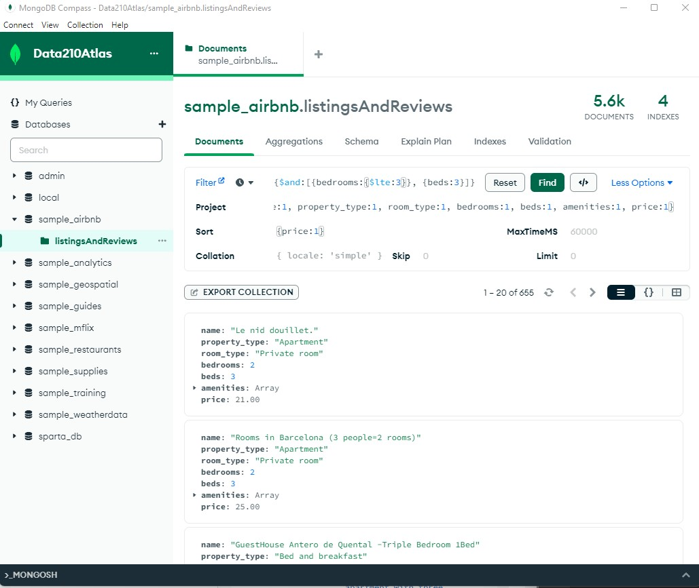


## $all operator

The `$all` operator means Mongo will not care about the order of elements in the array you give it:

```{products:{$all:["Derivatives", "InvestmentStock"]}}```

Gives 706 documents as it doesn't care about order.

```{products:["Derivatives", "InvestmentStock"]}```

Gives only 92 documents as the two elements need to be index 0 and 1 specifically.

# U - Update

Various updates and replace methods in MongoDB:

- updateOne()
- updataMany()
- replaceOne()
- findOneAndReplace()
- findOneAndUpdate()
- findAndModify()

# D - Delete

- deleteOne()
- deleteMany()

deleteMany is dangerous, if you do not give it anything to work from it will delete all documents in the collection!